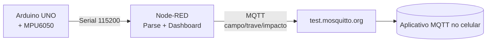
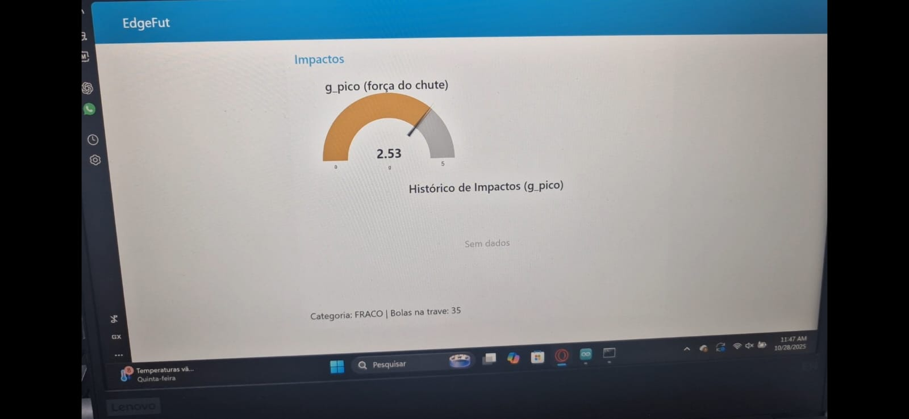
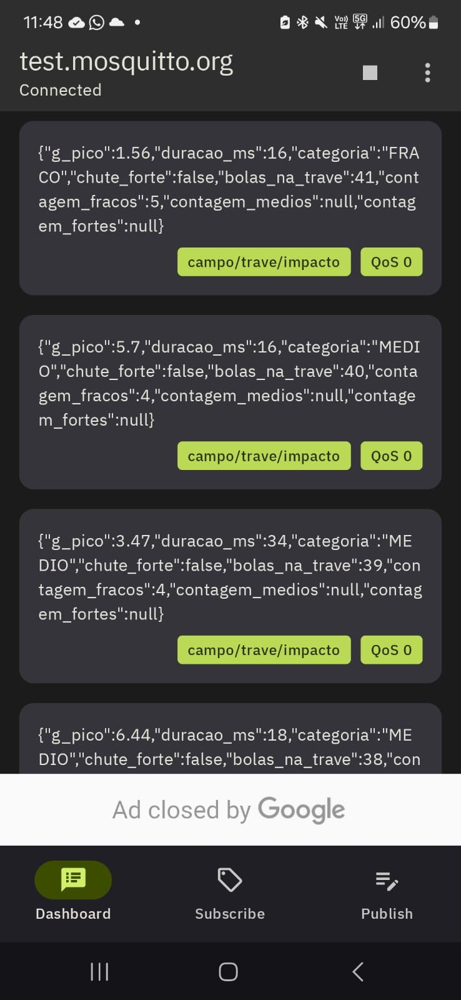

# Sprint 4 — Edge Computing: Detecção de “Bola na Trave” (IoT Físico)

Prova de conceito (PoC) física de um sistema IoT que detecta **impactos de bola na trave** usando um **Arduino UNO** com **sensor inercial MPU6050**.  
Os dados são processados localmente e enviados via **porta serial** para o **Node-RED**, que realiza o **parse**, exibe informações no **dashboard**, e publica no **broker MQTT** para visualização no **celular**.

---

## 👥 Integrantes
- **André Mateus Yoshimori** — RM 563310  
- **Eduardo Francisco Mauro Gonçalves** — RM 561969  
- **Ever Callisaya Amaru** — RM 563971  
- **Gabriel Luchetta dos Santos** — RM 561861  
- **Matheus Henrique Ferreira Camargo da Silva** — RM 566232

---

## ⚙️ Arquitetura do Sistema

Arduino UNO + MPU6050 → **Serial** → **Node-RED (parse + dashboard)** → **MQTT Broker** → **App Mobile**

---

### 🔹 Hardware
- **Arduino UNO**
- **Sensor MPU6050 (Acelerômetro + Giroscópio)**
- Conexões:
  - VCC → 5V  
  - GND → GND  
  - SDA → A4  
  - SCL → A5

---

## 🔄 Replicabilidade do Projeto

### 📍 Requisitos
- **Arduino IDE** com as bibliotecas:
  - Adafruit MPU6050  
  - Adafruit Unified Sensor  
  - Adafruit BusIO  
- **Node-RED** com a paleta `node-red-dashboard`
- **Broker MQTT**: `test.mosquitto.org:1883`
- (opcional) **App MQTT Dashboard** no celular

---

## 🚀 Execução

### 1️⃣ Arduino
- Carregue o código `sketch.ino` na placa **Arduino UNO**.  
- Verifique se o baud rate está em **115200**.  
- **Feche o Monitor Serial** após o upload (para liberar a COM4).  

### 2️⃣ Node-RED
- Importe o arquivo `node-red/edgefut_sprint4_flow.json`.  
- Configure o nó **Serial In** com a porta correta (ex.: COM4).  
- Clique em **Deploy** e abra o dashboard em  
  👉 `http://localhost:1880/ui`.

### 3️⃣ App MQTT (Celular)
- Conecte ao broker público:  
  **Servidor:** `test.mosquitto.org`  
  **Porta:** `1883`  
- Assine o tópico:  
  **`campo/trave/impacto`**  
- Observe as mensagens chegando em tempo real com as informações do chute.

---

## 🧩 Tópicos MQTT

| Tipo | Tópico | Exemplo |
|------|--------|----------|
| Dados | `campo/trave/impacto` | `{ "g_pico":2.46, "duracao_ms":860, "categoria":"MEDIO" }` |
| Status | `campo/trave/status` | `{"status":"online"}` |

---

## 📈 Resultados

Durante os testes físicos, o sistema **detectou corretamente os impactos** na trave e **classificou a força dos chutes** de acordo com o valor de aceleração medido pelo sensor.  
O **dashboard do Node-RED** exibiu em tempo real o **pico de aceleração (g_pico)**, a **categoria do chute** (*fraco, médio ou forte*) e o **contador de bolas na trave**.  

As informações também foram publicadas com sucesso no **broker MQTT (`test.mosquitto.org`)**, permitindo o monitoramento simultâneo pelo **aplicativo MQTT no celular**.  
Os resultados mostraram estabilidade nas medições, boa resposta ao impacto e comunicação consistente entre os módulos **Arduino → Node-RED → MQTT → App**.

**Resumo dos resultados observados:**
- ✅ Detecção precisa de impactos  
- ✅ Classificação automática da força (FRACO / MÉDIO / FORTE)  
- ✅ Comunicação serial e MQTT sem perdas  
- ✅ Dashboard com atualização em tempo real  
- ✅ Visualização simultânea no celular via MQTT Dashboard  

### 💻 Dashboard Node-RED

### 📱 Aplicativo MQTT

---

## 🧠 Observações Finais

O projeto **EdgeFut** demonstra a aplicação prática da **computação de borda** integrada à **Internet das Coisas (IoT)** em um contexto esportivo.  
A solução combina hardware acessível e ferramentas open-source para criar um sistema **eficiente, replicável e expansível**.

Com pequenas adaptações, essa arquitetura pode ser utilizada em diversos cenários — desde **monitoramento de treinos esportivos**, até **análise de desempenho e automação de alertas**.  
Além disso, a integração com o **Node-RED** permite fácil evolução para **bancos de dados**, **dashboards na nuvem** e **análises inteligentes de métricas de impacto**.

> 🔧 **Próximos passos sugeridos:**
> - Armazenar dados em um banco (ex.: InfluxDB ou Firebase)  
> - Criar alertas automáticos em casos de chutes fortes consecutivos  
> - Aplicar análise de dados para identificar padrões de desempenho  
